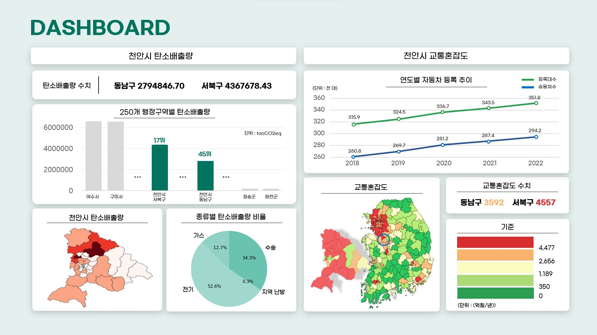

> # eBike-Station
2024.07.03 ~ 2024.08.25  
천안시 전기자전거 충전소 및 대여소 최적의 설치 위치 선정 프로젝트  
> ## 🖥 프로젝트 요약
- 천안시 내 전기자전거 충전소 및 대여소의 최적 설치 위치 선정 프로젝트
- 천안시 데이터를 활용한 현황 시각화 및 분석 진행
- MCLP 모델을 사용한 최적 위치 선정

> ## 🛠️ Tools
>  

 

> ## 🧱 MCLP

 

> ## 📊Dashboard

